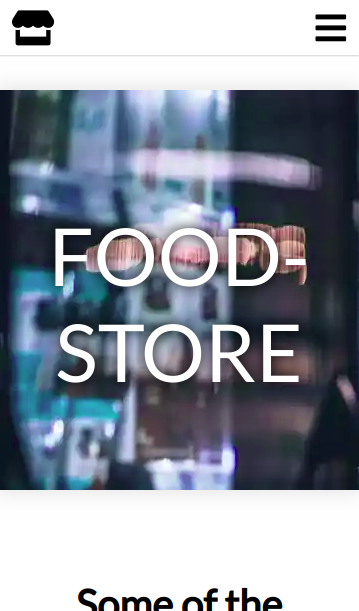

# Product Landing Page

## Introduction
This website shows a presentation of a product, a company or similar content, in this case a local supermarket. The page has to be fully responsive and show various elements as indicated below in the requirements. 

This project is part of freeCodeCamps Responsive Web Design certificate.

## Project Requirements
* The product landing page should have a header element with a corresponding id="header".
* The page shows an image within the header element with a corresponding id="header-img". A company logo would make a good image here.
* Within the #header element is a nav element with a corresponding id="nav-bar".
* There are at least three clickable elements inside the nav element, each with the class nav-link.
* Clicking a .nav-link button in the nav element leads to the corresponding section of the landing page.
* A product video with id="video" is embedded on the page.
* The landing page has a form element with a corresponding id="form".
* Within the form, there is an input field with id="email" which accepts an email address.
* The #email input field should have a placeholder text to let the user know what the field is for.
* The #email input field uses HTML5 validation to confirm that the entered text is an email address.
* Within the form is a submit button with a corresponding id="submit".
* When clicking the #submit element, the email is submitted to a static page (use this mock URL: https://www.freecodecamp.com/email-submit) that confirms the email address was entered and that it posted successfully.
* The navbar should always be at the top of the viewport.
* The product landing page should have at least one media query.
* The product landing page should utilize CSS flexbox at least once.

## Preview Images
### Main Screen:

